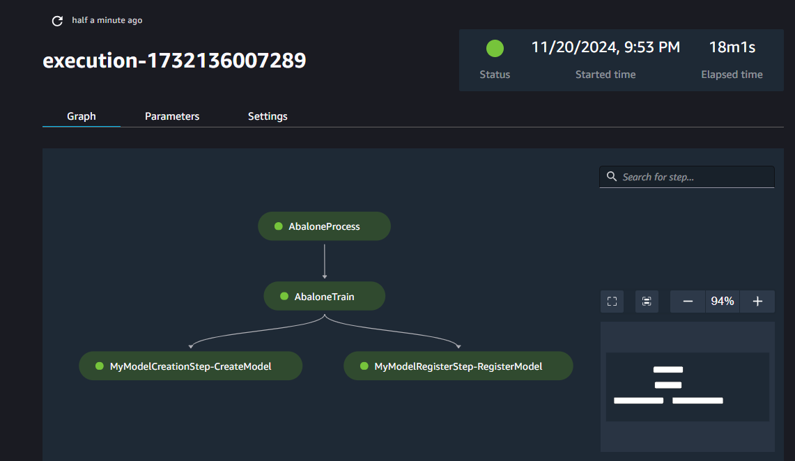
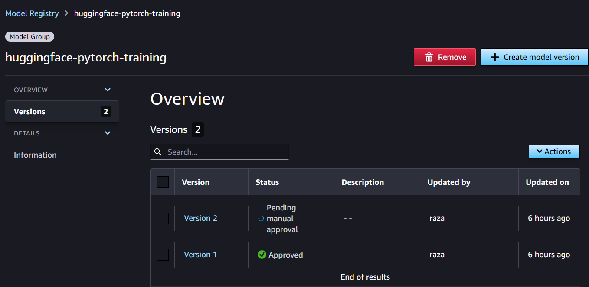
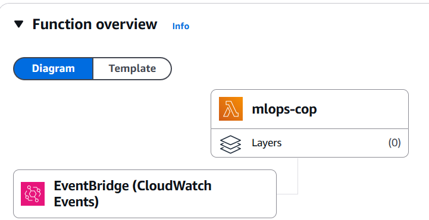

# SageMaker Pipelines for End-to-End Model Deployment

This project demonstrates the use of Amazon SageMaker Pipelines to run end-to-end workflows for model deployment. The pipeline includes steps for preprocessing, training, and creating and registering a model.

## Features

- **Preprocessing**: Data preparation and cleaning steps.
- **Training**: Model training with specified algorithms and parameters. The trained model artifacts are saved in an S3 bucket for later use.
- **Model Creation and Registration**: Steps to create and register the model in the model registry. Users can manually change the approval status of the model.

## Workflow Overview

When the model's approval status is changed to "approved," an event is triggered via AWS EventBridge. This event invokes a Lambda function that deploys the model using the saved artifacts.

## Architecture

### Model Registration

- **Version Control**: Track different versions of your models.
- **Approval Workflow**: Manage model approvals before deployment.

### Event Handling

Utilizes AWS EventBridge to respond to model package state changes.

### Lambda Functions

Leverage AWS Lambda for event-driven computations.

## Workflow Execution

The pipeline execution flow is illustrated below:

## Setup Instructions

1. Clone the repository.
2. Set up AWS credentials.
3. Install required dependencies.
4. Configure SageMaker settings as needed.
5. Run the pipeline using your preferred method.

## Contributing

Contributions are welcome! Please submit a pull request or open an issue for any enhancements or bug fixes.

## License

This project is licensed under the MIT License.